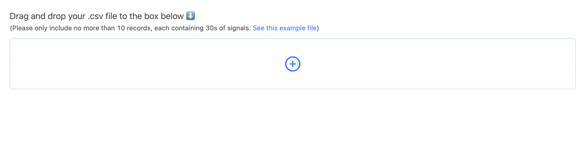
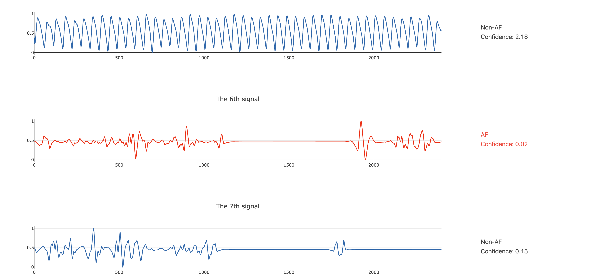

# Engineering

## Table of Contents
- [Abstract](#link-part-1)
- [Design](#link-part-2)
- [Data](#link-part-3)
- [Algorithm](#link-part-4)
- [Tools](#link-part-5)
- [Communication](#link-part-6)
- [**How to run**](#link-part-7)

## <a name="link-part-1">Abstract</a>

Atrial fibrillation (AF) is the most frequent arrhythmia, and many people are suffering
from atrial fibrillation. Usually people need to go to hospitals to be diagnosed which
would take time and money. Now we're providing a model that can make early detection of
AF based on your PPG signals. Users simply need to upload the data to our website, and
they can get the predicted result.

## <a name="link-part-2">Design</a>

The project has three main parts: training and testing the model, building the front-end
with React.JS, and building its back-end API with Flask. The front-end will receive a .cvs
file uploaded from user, and post it to the Flask API. Flask will then load the file into
a numpy array, checking if it's in the correct format. Then it will return the results to
the front-end page, which will then plot all the signals users uploaded and show the
classification results of all signals.

## <a name="link-part-3">Data</a>

The data is sourced from UCLA's clinical dataset. It's a huge dataset with more than 20GB
of PPG signals recorded from different hospitals and devices.

## <a name="link-part-4">Algorithm</a>

- Models

I built a Resnet 34 model with a Phd student in GT and trained it on Emory University's lab
machine.

- Front-end development (front-end code is [here](./Front-end))

The front-end page is developed using React.js, which is a very popular front-end technique.
There's a dropbox on the model page which allows users to drag and drop their files into the
dropbox to upload them. The front-end will check if the user only submits one file instead of
multiple and if the file is in correct format. If it doesn't satisfy the requirements, an
error message will be displayed on the page. Otherwise the front-end will post the file to
the Flask back-end. It then receives the result from the back-end and display the results as
well as plotting the signals provided by the user using Plotly.js.

- Back-end development (back-end code is [here](./Back-end))

The back-end server is developed using Flask. It receives the file posted by the front-end page
and convert it into a numpy array. Then it will convert each element of the numpy array (each
line of the document) into a pytorch tensor and input to the model. Then it will return the
model's output (classification result and confidence) back to the front-end page.

- Model deploy

I was going to deploy it to AWS, but due to the model and related packages being too big, it
wasn't able to fit into AWS free tire. Hence, I'm only testing it on my local machine now and
will deploy it to one of the servers in Emory University in the future.

## <a name="link-part-5">Tools</a>

* **Pandas** for exploratory data analysis
* **PyTorch** for building neural network
* **React.JS** for front-end development
* **React-plotly.js** for plotting
* **Spring Boot** and **Flask** for back-end development
* **AWS** and **Apache2** for deployment

## <a name="link-part-6">Communication</a>

<div align="center">
    
    
    
</div>

The project proposal is shown [here](/documents/proposal.md).

The MVP document shown [here](/documents/MVP.md).

## <a name="link-part-7">How to run</a>

For font-end page:

```
$ cd Front-end
```

Then install packages by running:

```
$ npm install
```

Then start the server:

```
$ npm start
```

The page will be available at [localhost:3000](http://localhost:3000).

The model page will be available at [localhost:3000/publications/afib](http://localhost:3000/publications/afib).
