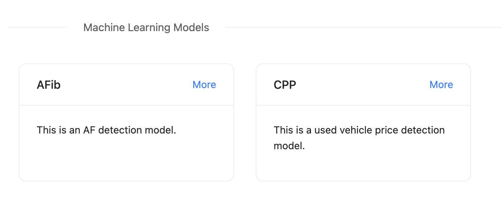
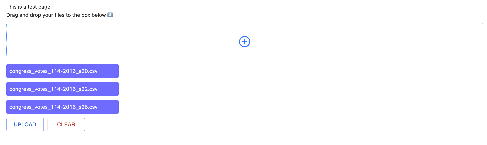

# MVP

## Web development

I have finished most part of web development. [Here](https://blog.darren-liu.com/publications)
is the home page, and you can enter the detection tool page by clicking on the "More" button
right next to "AFib" which is short for "atrial fibrillation" (name might change).

In [the tool's page](https://blog.darren-liu.com/publications/afib), I have built a drop box that
allows users to drag and drop their files into the box. For now the files will be uploaded to AWS
S3 bucket. However, when I get [ONNX](https://onnx.ai/) - a tool that can host a deep learning
model - working, I may directly forward those files to this api and return the results, or maybe
I would let ONNX to read files from AWS S3 bucket.

This page is also mobile devices adapive.
